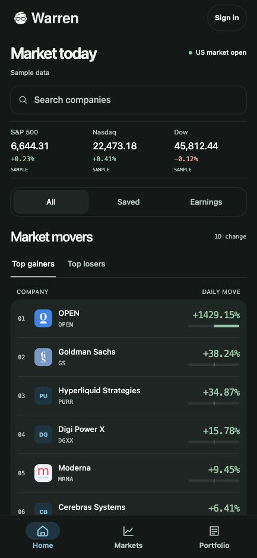
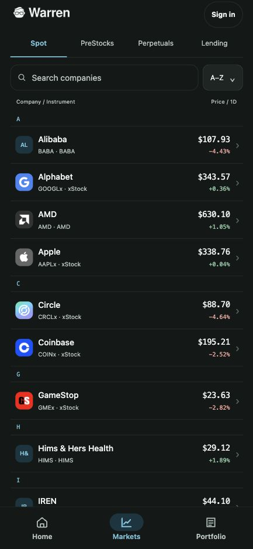
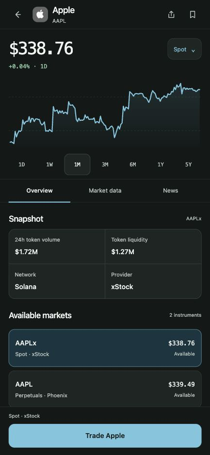

# Warren

**Tokenized stock markets on Solana, organized around companies.**

Stock-linked products are spread across issuers, trading venues, and lending protocols. The same company can have a spot token, private-market exposure, an equity perpetual, and a lending route—each with different prices and risks. Warren brings those markets into one mobile app while keeping the exact instrument, provider, network, and availability visible.

Start with a company. Understand the market behind it. Sign in only when you are ready to act.

## See the app

<table>
  <tr>
    <th>Home</th>
    <th>Markets</th>
    <th>Company detail</th>
  </tr>
  <tr>
    <td></td>
    <td></td>
    <td></td>
  </tr>
</table>

These are dark-mode captures of the running app's guest web preview at a phone-sized viewport. Market values change, and values labeled *Sample* are sample data. Native wallet signing is not shown in these screenshots.

## The Warren experience

1. **Discover without a wallet.** Home shows market context, movers, news, search, and locally saved companies.
2. **Choose the right market.** Markets separates Spot, PreStocks, Perpetuals, and Lending rather than treating them as interchangeable versions of a stock.
3. **Inspect the instrument.** A company page shows the relevant price history, provider, network, liquidity, and available instruments before a trade begins.
4. **Review before signing.** A supported spot or perpetual ticket can be configured as a guest. Executable terms require sign-in and a fresh provider quote; a wallet signature is requested only after review.
5. **Return to your portfolio.** The signed-in workspace is designed to show verified wallet holdings, positions, and Warren activity together.

Warren's API binds actions to the verified instrument and the user's wallet. A displayed market price is never reused as an executable quote.

## What is available today

| Area | Current state |
| --- | --- |
| Home, Markets, and company details | Runnable guest experience in the Expo web preview and mobile app. |
| Spot trading | Jupiter Swap V2 client and server flow implemented; physical-device transaction QA pending. |
| Equity perpetuals | Phoenix client and server flow implemented; physical-device transaction QA pending. |
| Sign-in and portfolio | Privy embedded Solana wallet integration and portfolio views are implemented; native configuration and device validation are required. |
| Lending | Kamino xStocks markets and terms are visible; lending actions are paused by default. |
| PreStocks | Discovery and instrument inspection; trading is not part of this flow. |

## Run the guest demo

Requires Node.js 22 or later and pnpm 10.

```bash
pnpm install
```

Start the API and web preview in separate terminals:

```bash
pnpm dev:api
```

```bash
pnpm web
```

Open `http://localhost:8081`. Explore Home, switch to Markets, and select a company such as Apple. The API runs at `http://localhost:3000`. Without a Tokens.xyz key, Home and Spot use fixture data and some detail history is unavailable. To use provider-backed stock data like the screenshots, set `TOKENS_API_KEY` in `apps/api/.env.providers.local`. Other API settings are described in [`.env.example`](.env.example); the API development scripts load `apps/api/.env.local` and `apps/api/.env.providers.local` when present.

For native development, use `pnpm dev` to start the API and Expo together. Privy sign-in requires an iOS or Android development build, not Expo Go or the browser preview. Copy `apps/mobile/.env.example` to `apps/mobile/.env.local`, add the public Privy App ID and mobile Client ID, and configure the `warren` URL scheme and `com.warren.app` identifier in Privy. On a physical phone, set `EXPO_PUBLIC_API_URL` to an API address the phone can reach. Never put a Privy app secret in an `EXPO_PUBLIC_*` variable.

## Technology stack

| Layer | Technologies and responsibility |
| --- | --- |
| Mobile app | React Native, Expo SDK 57, TypeScript, Expo Router, and Tamagui. Provides guest discovery and native account, market, and portfolio screens. |
| API | Node.js 22+, TypeScript, Fastify, and Zod. Serves app endpoints, validates requests, and connects to market and execution providers. |
| Wallet and identity | Privy embedded Solana wallets; Mobile Wallet Adapter for supported external-wallet sign-in. |
| Persistence | SQLite for Warren-owned sessions, execution intents, action journals, and portfolio snapshots. |
| Market data | Tokens.xyz, PreStocks, Phoenix, and Kamino data normalized behind Warren API contracts. |
| Transactions | Jupiter Swap V2 for spot swaps, Phoenix for equity perpetuals, and Kamino for xStocks lending. Solana RPC handles transaction submission and status checks. |
| Shared contracts | TypeScript packages with Zod schemas keep request and response shapes consistent between the mobile app and API. |

The mobile app talks to Warren's API rather than calling execution providers directly. The API resolves the selected company to a verified instrument, fetches current provider terms, and validates wallet-bound transaction requests. Provider secrets stay on the server.

## Repository layout

```text
apps/
  mobile/
    src/app/             Expo Router routes and navigation
    src/features/        Home, markets, portfolio, session, and Privy flows
    src/components/      Shared interface components
  api/
    src/server.ts        Fastify setup and route registration
    src/home/            Home feed and search
    src/markets/         Instrument registry and company details
    src/execution/       Spot and perpetual order lifecycle
    src/lending/         Kamino market and lending actions
    src/portfolio/       Wallet holdings, positions, and activity
packages/
  *-contract/            Shared API schemas and types
  test-wallet-provider/  Deterministic adapter for development and tests
docs/
  modules/               Product requirements, API contracts, and QA guides
  screenshots/           README app screenshots
```

The API's feature folders own provider adapters and business rules. The mobile app is organized around user-facing features, while the shared contracts define the boundary between them. Product requirements, API contracts, and QA notes are indexed in [`docs/modules`](docs/modules).

## Checks

```bash
pnpm test:api
pnpm typecheck
pnpm lint
```
