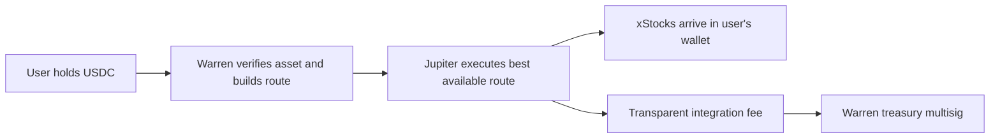

# Warren token and revenue strategy

## Executive decision

Warren should not begin by issuing a token. It should begin by becoming the safest and easiest place on Solana to discover, buy, hold, and later use tokenized stocks.

The recommended sequence is:

1. Ship the current spot product with verified stock tokens, transparent Jupiter routing, user-owned wallets, and a small execution fee.
2. Add **Warren Themes** as one-click baskets that buy the individual stock tokens directly into the user's wallet. Do not issue a basket token yet.
3. Add leverage later through a vetted external venue, with each position owned by the user. Do not put the Warren treasury into one perpetual trade.
4. Only after Warren has users and repeat volume, consider a separate speculative launchpad built on Meteora DBC.
5. If the company later wants a genuinely stock-backed basket token, make it a separate redeemable vault product—not the same token as the Warren utility/community token.

The short answer to “how much money is needed?” is:

| Goal | Practical planning range | What the money does |
|---|---:|---|
| Technical DBC experiment | **0.25–0.5 SOL operating buffer** | Account rent, transactions, metadata, retries, and any configured creation fee. Exact cost must be simulated against the chosen config. |
| Credible public community-token launch | **$20,000–$100,000** | Legal review, security review, operations, community support, and launch budget. This is a planning estimate, not a Meteora fee. |
| Non-custodial Warren Themes MVP | **No company-funded stock reserve** | Users buy and own each stock token. Company costs are engineering, security, compliance, and support. |
| Redeemable stock-basket token | **Reserve equal to 100% of token NAV**, plus roughly **$100,000–$350,000** in legal, security, issuer/custody, and operational setup | A $100,000 basket token needs approximately $100,000 of reserve assets before buffers and setup costs. |
| New perpetuals venue | **$1 million+** is a more realistic starting conversation | Liquidity, insurance, oracles, audits, liquidators, operations, and legal work. Warren should integrate first instead. |

These figures deliberately separate the cheap act of creating a token from the expensive act of making it credible, useful, secure, liquid, and legally operable.

## The simple CEO explanation: where does the value come from?

A token can have four very different sources of “value.” They must not be mixed up.

### 1. A market price

A bonding curve can create a quoted price. When buyers spend SOL, USDC, or a stock token, the curve raises the token's price according to a formula. This is **price discovery**, not backing.

Meteora DBC starts with virtual reserves and a mathematical curve. The virtual reserve controls how quickly the price moves; it is not money that the founder can withdraw. Real quote assets appear only when real buyers trade. When the configured migration target is reached, accumulated quote assets and base tokens are used to seed a DAMM v2 liquidity pool.[^4][^5]

### 2. Liquidity

Liquidity is the money available for buyers and sellers to trade against. It comes from:

- buyers who purchase along the bonding curve;
- the founder or a market maker depositing capital;
- migrated curve assets becoming an AMM pool; or
- another venue routing orders to existing markets.

A launchpad can remove the requirement for the founder to provide initial seed liquidity. It cannot guarantee that buyers will arrive.

### 3. Cash flow

Trading fees can create an economic benefit. StockDotFun's documented default is a 1% trading fee: 0.40% of volume goes to a stock-token reward vault for eligible holders, 0.30% goes to the token creator, and 0.30% goes to the protocol.[^13] That is real fee-funded value only when there is real trading volume.

Pairing a meme token with SPY, NVIDIA, or another stock token does **not** make the meme token a share of that stock. StockDotFun says this explicitly.[^12]

### 4. Backing and redemption

A stock-basket token has fundamental value only if its holder has a clear claim on a reserve and a way to redeem it. If one basket token represents $1 of underlying stocks, the issuer needs approximately $1 of eligible reserve assets for every $1 issued, subject to its legal and operating structure.

xStocks illustrates the distinction. Its issuer describes xStocks as collateralized tokenized securities with economic exposure to underlying assets and a defined issuance/redemption structure. Availability is jurisdiction-dependent, and the product does not give every holder direct shareholder rights in the underlying company.[^22][^23]

The key rule is:

> A trading pair creates a price. A reserve plus enforceable redemption creates backing.

## What Warren is currently building

The repository currently describes Warren as a mobile-first **spot-trading** product for tokenized stocks.[^1] Milestone 1 is deliberately narrow: users discover a small verified set of assets and buy them. It explicitly excludes leverage, perpetuals, short positions, agent trading, and lending.[^2]

The product language also emphasizes inspectable ownership: the interface should feel like an ownership register, with safety and proof taking priority over trading excitement.[^3] The wallet design points toward user-owned embedded EVM and Solana wallets rather than pooled company custody.

This is a good foundation. A native token, a creator launchpad, a basket security, and a perpetuals venue are four additional businesses. Building them before the spot product works would blur the promise and multiply the legal and technical surface.

## Protocol and competitor diligence

### Meteora DBC

Meteora Dynamic Bonding Curve is a permissionless Solana launch primitive. A creator sets a reusable launch configuration, creates a virtual pool, lets users buy along one or more constant-product curve segments, and migrates to DAMM v2 at a defined quote threshold.[^4][^6]

What it gives Warren:

- no requirement for the creator to seed the initial virtual pool;
- configurable price discovery and migration threshold;
- SOL, USDC, and supported Token-2022 assets as possible quote tokens;
- configurable trading, migration, and pool-creation fees;
- partner and creator fee claims during the curve;
- automated DAMM v2 migration for supported threshold/config combinations; and
- post-migration liquidity allocation that can be unlocked, permanently locked, or vested.[^5][^6][^7]

What it does not give Warren:

- equity backing;
- buyers;
- guaranteed post-launch liquidity;
- legal clearance;
- price stability;
- a working stock-token reward distribution product; or
- protection from bad launch configuration.

Meteora takes 20% of the DBC trading fee. The remaining 80% is split between the configured partner and creator. A referral can receive 20% of Meteora's protocol portion. The optional pool-creation fee is split 10% to Meteora and 90% to the partner, while DAMM v2 migration has a fixed 0.2% protocol liquidity migration fee.[^7]

For stock-token quote pairs, operational details matter. Meteora documents support for certain “Stock Tokens,” but Token-2022 extensions such as a permanent delegate require an operator-created TokenBadge. A quote token's transfer fee must be zero, including any scheduled transfer fee.[^8] Warren must therefore maintain an explicit allowlist of quote mints and verify badge support before showing a launch button.

Meteora's public migration keeper will auto-migrate supported stock-token quote pools when the configured quote threshold is at least **$750 equivalent**. Buyers can collectively contribute that value through curve purchases; the founder only needs to supply it if the founder wants to force graduation personally.[^5]

Security posture: Meteora publishes multiple DBC audits.[^9] In the 0.2.0 reviews, Offside Labs reported one high-severity issue that was fixed and one medium external transfer-hook risk that Meteora acknowledged; Zenith reported no critical, high, or medium findings and several lower-severity observations.[^10][^11] This supports using the audited program, but it does not audit Warren's configuration, front end, fee distributor, or any custom contracts. The acknowledged transfer-hook dependency is another reason not to add an experimental transfer hook to `$STOK`.

Decision: Meteora DBC is technically suitable for an optional Warren **community-token launchpad**. It is not, by itself, a suitable mechanism for creating a stock-backed basket.

### StockDotFun

StockDotFun is the closest conceptual benchmark for “a token paired with a stock.” It is documented as a Robinhood Chain launchpad where a creator deploys a meme token and bonding-curve pool in one transaction, paired with a supported Robinhood stock token and without creator-supplied seed liquidity.[^12]

Its economic loop is straightforward:

| On a $100 trade | Amount | Purpose |
|---|---:|---|
| Total fee | $1.00 | 1% default fee |
| Holder reward vault | $0.40 | Accumulates the paired stock token or routed value for eligible holders |
| Creator | $0.30 | Creator revenue |
| Protocol | $0.30 | Platform revenue |

The attractive idea is not “meme token equals stock.” It is: **speculative trading fees buy or accumulate a recognizable stock token, creating an observable reward stream.** That mechanism is understandable and revenue-linked.

The weaknesses are equally important. StockDotFun says the pairing does not convey ownership of the paired stock, supported assets carry issuer/custody/tracking and liquidity risks, and the contract foundation is unaudited. Its published terms are described as a template subject to revision.[^12][^14][^15] Warren can learn from its fee loop, but should not copy its legal wording or treat it as production assurance.

Robinhood's own documentation reinforces the distinction: Robinhood Stock Tokens are tokenized debt securities issued by Robinhood Assets (Jersey) that provide economic exposure but do not grant legal or beneficial ownership in the underlying equity. Direct minting is limited to authorized participants.[^16][^17]

Decision: copy the clarity of the fee loop, not the suggestion that mere pairing creates stock exposure.

### StonkFun: the closer Solana comparison

StonkFun is a different product from StockDotFun, but it is a closer Solana implementation comparison. Bitquery's integration documentation describes StonkFun launches using Raydium LaunchLab, including stock-token pairs, with curve graduation to Raydium CPMM.[^18] Raydium's own LaunchLab documentation also describes no-seed-liquidity launches and estimated interface creation costs around 0.05–0.5 SOL depending on launch mode.[^19]

DefiLlama currently reports substantial recent fee and revenue activity for StonkFun, but the observed numbers are highly concentrated around a recent launch window and should not be treated as a normal monthly run rate.[^20] The useful lesson is that stock-themed quote assets can attract attention. The dangerous lesson would be to forecast a new Warren business from a short burst of competitor activity.

### Perpspad

Perpspad links token fees to a leveraged perpetual position and uses some resulting profits for token buybacks or treasury/creator distributions.[^21] This can create a dramatic narrative, but it also converts operating cash flow into liquidation risk. Its paper also contains inconsistent distribution percentages between sections, which is a warning that the economics need formal specification before capital is committed.

Warren's core promise is understandable ownership. A platform token whose perceived backing is a leveraged trade is the opposite: users must understand trading fees, position margin, oracle behavior, funding, liquidation, profit realization, and buyback discretion. Warren should not use this design for its primary token or treasury.

## Recommended product architecture

### Phase 1: trusted spot execution

The first product should make tokenized stocks safe enough to understand and easy enough to buy:

- a verified registry of canonical issuer and mint addresses;
- clear labels explaining what legal/economic rights each asset does and does not provide;
- jurisdiction checks and geo restrictions;
- Jupiter route comparison and explicit slippage/minimum received;
- user-owned wallet signing;
- portfolio accounting and corporate-action handling; and
- transparent fees before signature.

Jupiter's current meta-aggregator referral model permits an integrator fee between 50 and 255 basis points and retains 20% of that integrator fee.[^24] A 50 bps customer fee therefore gives Warren approximately 40 bps net before its own costs. Warren should begin at the low end and show the fee as a separate line item, rather than hiding a spread.

### Phase 2: Warren Themes without a basket token

The simplest useful stock basket is a **transaction bundle**, not a new security. The user selects a theme and amount; Warren splits the amount across component xStocks and sends those individual tokens to the user's wallet.

Example launch theme for product testing:

| Component | Weight | Product reason |
|---|---:|---|
| SPYx | 35% | Broad US large-cap core |
| QQQx | 25% | Large-cap growth/technology exposure |
| NVDAx | 15% | Recognizable AI/semiconductor component |
| AAPLx | 15% | Recognizable consumer technology component |
| MSFTx | 10% | Cloud/software diversification |

This is a product prototype, not an investment recommendation. The final asset list should be based on permitted jurisdictions, verified mints, route depth, price impact, issuer terms, and operational availability. xStocks lists products including SPYx, QQQx, NVDAx, AAPLx, and MSFTx, while its partner materials require partners to implement jurisdiction controls.[^22][^23]

Each purchase should show the components, weights, estimated price impact, Warren fee, and minimum received before the user signs. If Solana transaction-size or route constraints require multiple transactions, the interface must handle partial completion and offer a safe resume path.

The theme can be rebalanced in one of two ways:

- new purchases use the latest target weights, without touching old holdings; or
- the user explicitly signs a rebalance that sells and buys components.

There should be no silent automated trading and no pooled customer assets.

### Phase 3: leverage through integration

Leverage should be a separate “Pro” mode after the spot product is trusted. The initial design should use an external, independently reviewed venue:

- the user's wallet owns the position;
- isolated margin is the default;
- 2x is the initial UI default, with a conservative maximum;
- liquidation price, funding, fees, and oracle are visible before signature;
- Warren never uses spot customer assets as margin; and
- any referral/revenue share is based on a signed venue agreement, not assumed in the financial model.

Venue selection requires a separate diligence project covering stock-market trading hours, oracle behavior when equities are closed, funding, open interest, liquidators, insurance, contract audits, jurisdiction, and whether the venue is actually accessible to Warren's target users. This work is outside the current Milestone 1 scope.

### Phase 4: optional community-token launchpad

If spot volume and user retention are real, Warren can add a clearly separated “Labs” area for speculative community tokens paired with supported stock tokens through Meteora DBC.

A conservative starting configuration would be:

- fixed supply;
- standard SPL or simple Token-2022 base token with no transfer hook;
- one simple curve segment so price behavior is explainable;
- supported and badged stock-token quote mint with zero transfer fee;
- 1% total curve trading fee;
- 25% of the post-protocol fee to the creator and 75% to Warren;
- zero or low migration fee;
- migrated liquidity permanently locked, if the actual config enforces this; and
- revocable authorities removed where consistent with compliance needs.

With Meteora's 20% protocol share, this illustrative 1% fee produces the following on a $100 trade:

| Recipient | Share of the $1 fee |
|---|---:|
| Meteora protocol | $0.20 |
| Creator | $0.20 |
| Warren partner | $0.60 |

The creator receives 25% of the remaining $0.80, not 25% of the original trade fee. Warren can use Meteora's Dynamic Fee Sharing to route compatible claimed fees among two to five fixed recipients, such as operations, treasury, and a disclosed community reward vault.[^25]

A 0.10 SOL pool-creation fee would send 0.09 SOL to Warren and 0.01 SOL to Meteora under the documented 90/10 split. This can deter spam, but it is not a strong business by itself. Trading volume matters much more than launch count.

## The token decision

### Recommended: no `$STOK` at launch

Start with non-transferable points or account status for:

- fee discounts;
- early access to new themes;
- education and risk-quiz completion;
- referrals that pass anti-sybil checks; and
- governance experiments over catalogue or interface priorities.

Points let Warren test whether incentives improve retention without creating a liquid asset whose price becomes the product.

### If `$STOK` is launched later

`$STOK` should be a utility/community token, not marketed as stock-backed. Sensible guardrails are:

- fixed, disclosed supply;
- no hidden mint path;
- team and treasury allocations vested onchain;
- no transfer tax;
- no promise of dividends or guaranteed appreciation;
- fee discounts and access based on measurable product use;
- treasury and fee policy controlled by a multisig with public reporting;
- any buyback policy explicitly discretionary and reviewed by counsel; and
- no treasury leverage tied to the token.

The exact supply and allocation should be decided only after Warren knows its user-acquisition cost, retention, volume, and reward budget. Choosing “one billion tokens” does not create value; it only changes the number of units.

### If Warren wants a true basket token

Use a separate name, such as `STOCK5`, and a separate legal/technical structure. Do not call it `$STOK`.

The minimum invariants are:

1. `STOCK5` is minted only when eligible reserve assets are deposited or purchased.
2. It is burned when the holder redeems.
3. Reserve value is at least outstanding token NAV, with a defined cash/rebalancing buffer.
4. The issuer, custodian, beneficial rights, fees, corporate actions, insolvency treatment, and redemption process are disclosed.
5. Reserve balances and outstanding supply are independently attestable.
6. Price oracles have freshness and closed-market rules.
7. Geo restrictions and KYC/AML obligations are implemented where required.
8. DBC is not the primary issuance mechanism. Primary mint/redemption happens at NAV; a secondary AMM can be added afterward.

Without these properties, the product is only a token themed around stocks, not a tokenized stock basket.

## Revenue model

Warren should earn money when it creates a useful transaction, not by silently trading against the user.

### Recommended revenue stack

1. **Spot and theme execution:** 50 bps gross integrator fee through Jupiter, approximately 40 bps net after Jupiter's documented 20% share of the integrator fee.[^24]
2. **Pro subscription:** optional advanced analytics, tax exports, alerts, and professional order controls; for example $10 per month.
3. **Labs launch fee:** optional 0.10 SOL DBC pool-creation fee, of which 90% goes to Warren under Meteora's fee split.[^7]
4. **Labs trading fee:** approximately 60 bps to Warren under the illustrative DBC configuration above.
5. **Post-migration LP economics:** only the fee rights that the actual locked/vested DAMM v2 liquidity position grants; disclose them before launch.
6. **Perpetuals referral or venue share:** recognize only after a vetted venue and signed commercial agreement exist.

Illustrative monthly revenue—not a forecast:

| Activity | $500k monthly volume | $5m monthly volume | $50m monthly volume |
|---|---:|---:|---:|
| Spot/themes at 40 bps net | $2,000 | $20,000 | $200,000 |
| DBC partner fee at 60 bps | $3,000 | $30,000 | $300,000 |

Other examples:

- 1,000 Pro subscribers at $10/month = $10,000/month.
- 100 launches at a 0.10 SOL creation fee = 9 SOL to Warren before tax and operating costs.

These streams should not be added together unless the corresponding businesses actually exist. Revenue is before customer support, RPC/indexing, security, compliance, taxes, refunds, incentives, and salaries.

### Revenue mechanisms to avoid

- hidden price markup or undisclosed spread;
- using customer stock tokens in a treasury trade;
- promising yield funded mainly by new token buyers;
- using `$STOK` sales as recurring operating revenue;
- representing a stock pair as stock backing;
- excessive launch taxes that make selling punitive; and
- paying rewards solely for circular wash volume.

## Budget in more detail

### A. Technical token experiment

On devnet, onchain capital can be obtained from a faucet. On mainnet, the exact SOL needed depends on whether Warren reuses a DBC config or creates one, metadata/accounts, any configured pool-creation fee, transaction priority, and failed attempts. Meteora documents configurable creation fees from 0.001 to 100 SOL but does not publish one universal all-in deployment price.[^6][^7]

For planning, keep 0.25–0.5 SOL in the isolated deployer wallet and simulate every transaction before signing. This is an operating buffer, not a claim that the protocol will consume all of it.

If the launch uses a stock token as quote and relies on Meteora's public keeper, organic buyers must collectively bring the pool to at least the supported $750-equivalent migration threshold. Founder money is not mandatory, but a launch with no buyer demand will not graduate.[^5]

### B. Credible public community token

A rough company planning range is $20,000–$100,000, excluding salaries and optional market-making capital:

| Workstream | Planning range |
|---|---:|
| Legal and launch-document review | $10,000–$50,000 |
| Security/configuration review | $5,000–$25,000 |
| Monitoring, support, and launch operations | $2,500–$10,000 |
| Community education and initial campaign | $2,500–$15,000 |

These are judgment ranges for budgeting and must be replaced by vendor quotes in the chosen jurisdictions.

### C. Non-custodial basket UX

Warren does not need to buy the basket. Each user supplies USDC and receives the individual xStocks. The company funds engineering, security, compliance, RPC/indexing, and support, but not inventory.

A lean production planning envelope outside current salaries is roughly $50,000–$200,000, driven more by legal, geo-compliance, and security requirements than by Solana transactions. This range should also be replaced by scoped vendor quotes.

### D. Redeemable basket token

This is the capital-intensive path:

- reserve: approximately 100% of outstanding NAV;
- cash/rebalancing buffer: policy-dependent;
- legal wrapper, offering/redemption documents, and jurisdiction analysis;
- qualified issuer/custody and banking/off-ramp relationships where required;
- smart-contract and operational security review;
- market data/oracle and corporate-action processing; and
- independent attestations.

For example, a $100,000 pilot supply needs approximately $100,000 of eligible stock-token reserve, plus a planning allowance of $100,000–$350,000 for setup and controls. A credible first program is therefore more likely to require $200,000–$450,000 than “a few SOL.” Broader jurisdiction coverage or custom licensing can raise this materially.

### E. Perpetuals

Integrating a vetted venue is an engineering and diligence project. Operating a venue is a liquidity, risk, security, and regulatory business. Warren should not plan to own a perpetuals protocol until it has substantial spot volume, a dedicated risk team, audited contracts, reliable oracle/liquidator infrastructure, and at least seven figures of risk capital or committed liquidity.

## Technical design and controls

### Spot and themes

- **Asset registry:** canonical mint, issuer, chain, token program, authorities, oracle, eligibility, legal links, and current status.
- **Route service:** Jupiter quote, fee account, price impact, expiry, and exact minimum output.
- **Theme composer:** deterministic weights, rounding rules, per-leg minimum output, and safe recovery from partial fills.
- **Wallet:** user-owned Privy wallet; Warren never retains a withdrawal key.
- **Portfolio/indexer:** token balances, cost basis, issuer rebases or corporate actions, and price-source timestamp.
- **Policy engine:** jurisdiction/eligibility checks before quoting and again before transaction construction.
- **Treasury:** multisig, separated fee accounts, transaction policy, and public reporting.

### DBC Labs

- use the official DBC SDK and verify the published program ID rather than trusting an arbitrary front end;[^26]
- allow only Warren-approved config keys and quote mints;
- verify TokenBadge and zero-transfer-fee requirements at launch time;
- publish curve shape, migration threshold, all fee shares, authorities, and liquidity lock before signature;
- index curve progress, fee claims, and migration state independently;
- use a separate creator/deployer wallet from the company treasury;
- rate-limit launches and review token names/metadata for impersonation; and
- commission an independent review for every custom program or distributor.

### Non-negotiable product wording

- “Paired with SPYx” does not mean “backed by SPY.”
- “Stock-themed token” does not mean “tokenized stock.”
- “Indicative NAV” does not mean “redeemable NAV.”
- “Fee-funded rewards” are variable and can fall to zero.
- “Token price” is not the same as company revenue or reserve value.

## Risk and compliance gates

xStocks states that availability excludes or restricts several jurisdictions, including the United States and US persons, the United Kingdom, Canada, Australia, and sanctioned regions, and asks distribution partners to implement geographic compliance.[^22][^23] Robinhood Stock Tokens have a different issuer and legal structure, and Robinhood Chain is EVM rather than Solana.[^16][^17]

Before production, counsel should classify each planned activity separately:

| Activity | Principal question |
|---|---|
| Routing an xStock trade | Can Warren market and route this product to this user in this jurisdiction? |
| Charging an execution fee | What disclosures, registrations, and best-execution duties apply? |
| Selling `$STOK` | Is it a utility token, security, financial promotion, or another regulated instrument? |
| Sharing fees or buying back `$STOK` | Does this create an expectation of profit from the team's efforts? |
| Issuing `STOCK5` | Is it a security, fund/collective vehicle, derivative, debt instrument, or tokenized certificate? |
| Offering leverage | What derivatives, margin, suitability, and consumer-protection rules apply? |

This memo is technical and business research, not legal or investment advice.

## Ninety-day execution plan

### Days 1–15: lock the truth layer

- Select initial jurisdictions with counsel.
- Build the verified asset registry and incident/delist process.
- Confirm xStocks integration eligibility and canonical mints.
- Implement Jupiter referral accounts and fee disclosure.
- Define analytics: funded wallet, executed volume, repeat trader, price impact, and support incidents.

### Days 16–45: ship spot and themes

- Finish the current onboarding and wallet milestone.
- Ship individual tokenized-stock buying.
- Add one five-asset Warren Theme as direct component purchases.
- Add partial-fill recovery, transaction simulation, and receipts.
- Test 50 bps gross pricing against conversion and routing quality.

### Days 46–70: learn before tokenizing

- Interview funded and abandoned users.
- Measure whether themes increase first purchase, repeat volume, and portfolio retention.
- Launch non-transferable points only if a specific behavior needs encouragement.
- Complete external application security and transaction-construction review.

### Days 71–90: DBC sandbox, not public token

- Create a devnet DBC configuration and sample launch.
- Test one stock-token quote mint's TokenBadge and migration behavior.
- Build the fee and curve disclosure screen.
- Model bot activity, failed migration, low liquidity, issuer pause/freeze, and quote-token depeg.
- Obtain a written legal go/no-go before any mainnet community launch.

### Go/no-go gates

Consider a mainnet DBC Labs launch only when:

- spot has repeat users and stable execution;
- Warren can explain every fee in one screen;
- stock-token quote support has been verified end to end;
- contracts/configuration have had independent review;
- monitoring and incident response are live; and
- legal counsel has approved the target user and jurisdiction policy.

Consider `$STOK` only after at least three months of measurable retention and revenue. A useful internal threshold would be several million dollars of monthly spot volume plus evidence that fee discounts, access, or governance solve a real user problem. The threshold is a decision rule, not a promise to issue a token.

## Final recommendation to the CEO

The highest-value move is not “launch a token cheaply.” It is to create the trusted transaction layer around assets users already understand.

Warren's durable advantages can be:

1. **Trust:** verified mints, plain-language rights, visible authorities, and safety controls.
2. **Convenience:** one wallet, one portfolio, best routing, and one-click themes.
3. **Ownership:** individual assets arrive in the user's wallet; Warren does not pool them.
4. **Distribution:** creators can later launch separate speculative communities with stock-token fee loops.
5. **Revenue:** transparent execution, subscription, and launch infrastructure fees.

Build the user and revenue engine first. Add a community token only when it improves that engine. Build a stock-backed basket token only when Warren is ready to become an issuer or work with one.

## Sources

[^1]: Warren repository, [`README.md`](../../README.md).
[^2]: Warren repository, [`docs/milestone/milestone-one.md`](../milestone/milestone-one.md).
[^3]: Warren repository, [`docs/modules/theme-design/phase-zero.md`](../modules/theme-design/phase-zero.md).
[^4]: Meteora, [What is Dynamic Bonding Curve?](https://docs.meteora.ag/core-products/dbc/what-is-dbc) and [Universal Dynamic Bonding Curve](https://docs.meteora.ag/core-products/dbc/universal-curve).
[^5]: Meteora, [Migration and Liquidity](https://docs.meteora.ag/core-products/dbc/migration-and-liquidity).
[^6]: Meteora, [Launch Configurations](https://docs.meteora.ag/core-products/dbc/launch-configurations) and [Accounts and Permissions](https://docs.meteora.ag/core-products/dbc/accounts-and-permissions).
[^7]: Meteora, [DBC Fees Overview](https://docs.meteora.ag/core-products/dbc/fees/overview) and [DBC Formulas](https://docs.meteora.ag/core-products/dbc/formulas).
[^8]: Meteora, [Token-2022 Support](https://docs.meteora.ag/core-products/dbc/token-2022-support).
[^9]: Meteora, [DBC Audit Index](https://docs.meteora.ag/resources/audits/dbc).
[^10]: Offside Labs, [Meteora DBC 0.2.0 Security Assessment](https://github.com/MeteoraAg/audits/blob/main/dbc/offside-labs-dbc-audit-0.2.0.pdf).
[^11]: Zenith, [Meteora DBC 0.2.0 Audit Report](https://github.com/MeteoraAg/audits/blob/main/dbc/zenith-dbc-audit-0.2.0.pdf).
[^12]: StockDotFun, [How It Works](https://www.stockdotfun.com/docs/how-it-works).
[^13]: StockDotFun, [Trading Fees and Revenue Split](https://www.stockdotfun.com/docs/fees).
[^14]: StockDotFun, [Supported Stock Tokens](https://www.stockdotfun.com/docs/supported-assets), [Contracts](https://www.stockdotfun.com/docs/contracts), and [Risk Disclosure](https://www.stockdotfun.com/risk).
[^15]: StockDotFun, [Terms template](https://www.stockdotfun.com/terms).
[^16]: Robinhood Chain, [Chain Documentation](https://docs.robinhood.com/chain/).
[^17]: Robinhood Chain, [Stock Tokens](https://docs.robinhood.com/chain/stock-tokens/) and [Deploy Smart Contracts](https://docs.robinhood.com/chain/deploy-smart-contracts/).
[^18]: Bitquery, [StonkFun API and Raydium LaunchLab integration](https://docs.bitquery.io/docs/blockchain/Solana/stonkfun-api/).
[^19]: Raydium, [Creating a LaunchLab Token](https://raydium.mintlify.app/user-flows/creating-a-launchlab-token).
[^20]: DefiLlama, [StonkFun fees and revenue dashboard](https://defillama.com/protocol/stonkfun?events=false&revenue=true&tvl=false).
[^21]: Perpspad, [Whitepaper](https://perpspad.fun/paper).
[^22]: xStocks, [Product overview](https://xstocks.com/) and [Products](https://xstocks.com/products).
[^23]: xStocks, [Partner documentation](https://xstocks.com/partner) and Backed, [Legal Documentation](https://assets.backed.fi/legal-documentation).
[^24]: Jupiter, [Referral Program](https://developers.jup.ag/docs/tool-kits/referral-program) and [Swap Order and Execute](https://developers.jup.ag/docs/swap/order-and-execute).
[^25]: Meteora, [Dynamic Fee Sharing](https://docs.meteora.ag/helper-products/dynamic-fee-sharing/what-is-dynamic-fee-sharing).
[^26]: Meteora, [DBC TypeScript SDK Getting Started](https://docs.meteora.ag/developer-guides/dbc/typescript-sdk/getting-started), [examples](https://docs.meteora.ag/developer-guides/dbc/typescript-sdk/examples), and [official SDK repository](https://github.com/MeteoraAg/dynamic-bonding-curve-sdk).
